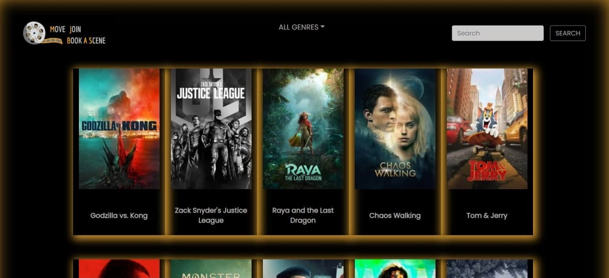

## Project Name & Pitch 

Movies Hub

Online searchable source for movies information including rating, cast, trailor and actross bio.

## Project Status

In this app you can browse trending movies, search for a specific movie, or filter movies by categories. This app is build with reactJS, Bootstrap and it is fetching data from the moviedb API.

To Visit our Movies Hub: https://movieshub-search.web.app/

## Project Screen Shot(s)

### Home Page

### Movie Details page 

![movieDetails] (./src/assests/movieDetails.jpg)

## Installation and Setup Instructions

Clone down this repository. You will need node and yarn installed globally on your machine.

Installation:

yarn

To Start Server:

yarn start

To Visit App:

localhost:3000/

## Reflection

Movies Hub app was build as a one of front-end bootcamp team projects hosted by re:coded.
